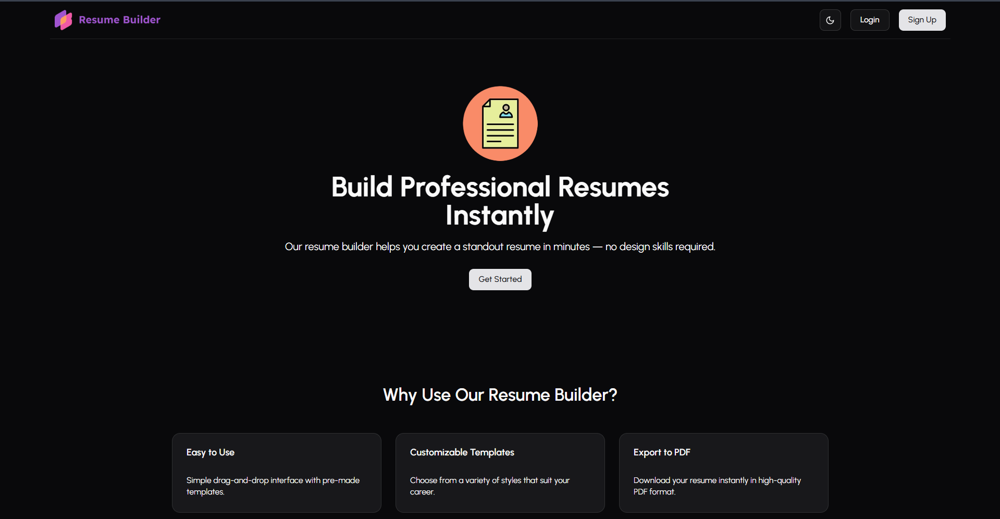
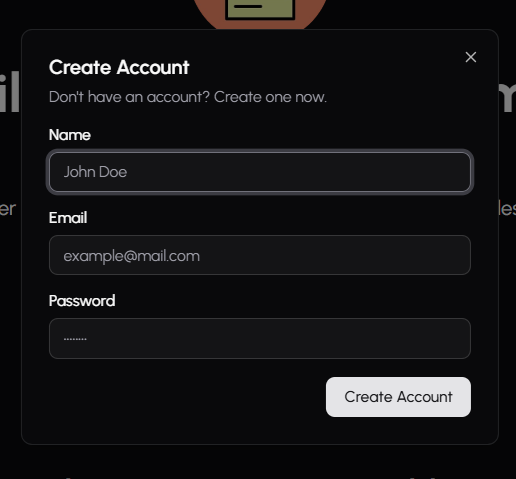
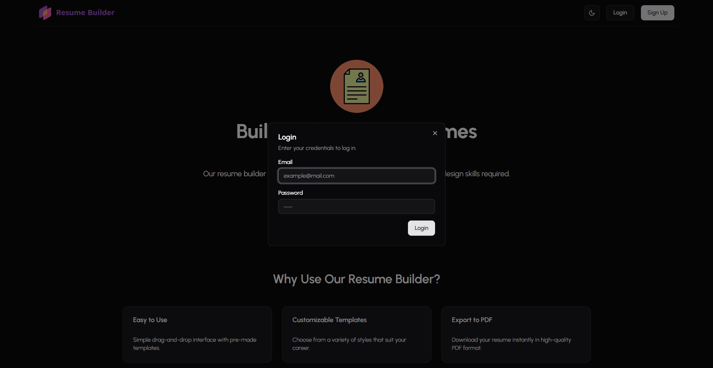
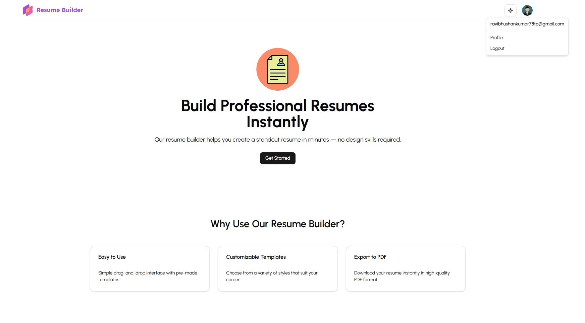
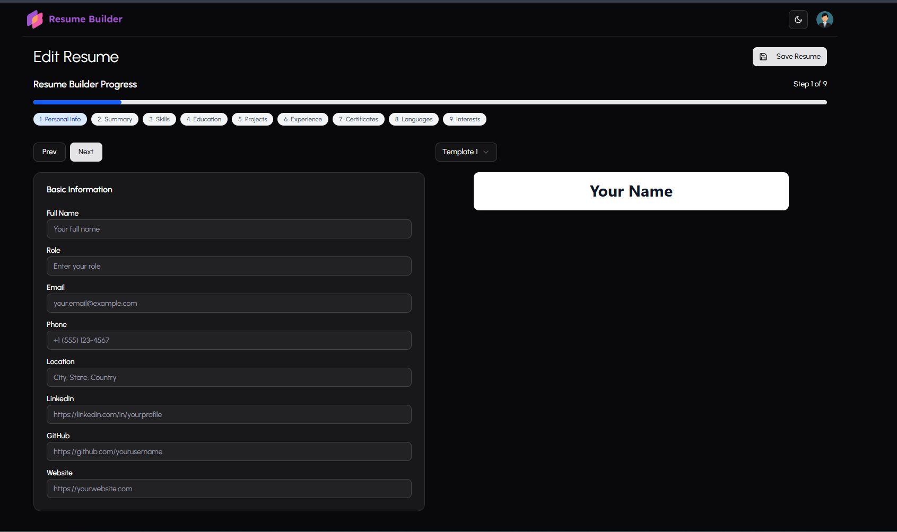
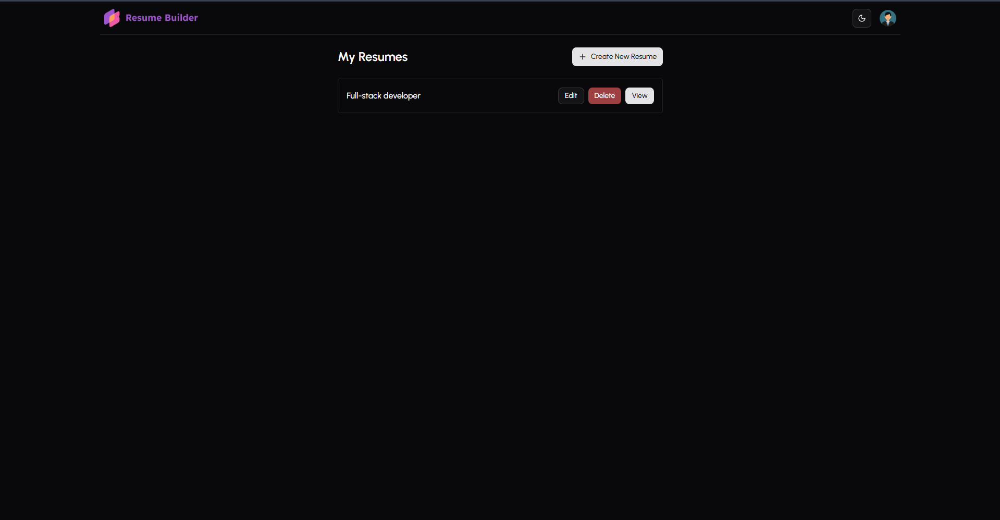

# 📄 Resume Builder

A modern, full-stack resume builder application with real-time preview, PDF export, and cloud storage. Built with React, Redux, and Node.js for a seamless resume creation experience.


## 📸 Screenshots

<table align="center">
  <tr>
    <td align="center">
      <br/>
      <em>Home Page</em>
    </td>
    <td align="center">
      <br/>
      <em>Sign up section</em>
    </td>
  </tr>

  <tr>
    <td align="center">
      <br/>
      <em>Login section</em>
    </td>
    <td align="center">
      <br/>
      <em>Toggle theme</em>
    </td>
  </tr>

  <tr>
    <td align="center">
      <br/>
      <em>Resume creation</em>
    </td>
     <td align="center">
      <br/>
      <em>Download Resume</em>
    </td>
  </tr>
  
</table>


## [Live Demo](https://resume-builder-ruby-omega.vercel.app/)

##  🌟Features

###  🫰**Modern UI/UX**
- Clean and intuitive interface
- Real-time resume preview
- Responsive design for all devices
- Smooth animations and transitions
- Context-based state management

### 📝 **Comprehensive Resume Sections**
- Personal Information & Contact Details
- Professional Summary
- Education History
- Work Experience
- Skills & Expertise
- Projects Portfolio
- Certifications & Awards
- Custom Sections

### 💾 **Advanced Functionality**
- PDF export with professional formatting
- Cloud storage for resume data
- Multiple resume templates
- Auto-save functionality
- Resume version history
- Share resume via unique link

### 🔐 **User Management**
- User authentication & authorization
- Secure data storage
- Multiple resume management
- Profile customization

### 🚀 **Technical Excellence**
- Redux for state management
- Context API for theme & settings
- RESTful API architecture
- MongoDB database integration
- Middleware for authentication
- File upload handling


## 🛠️ Technologies used
   
###Frontend (Client)
| Technology | Purpose | Version |
|------------|---------|---------|
| React | UI Framework | 18+ |
| Redux | State Management | Latest |
| React Context | Theme & Settings | - |
| Vite | Build Tool | Latest |
| CSS3 | Styling | - |
| JavaScript (ES6+) | Programming Language | - |

### Backend (Server)
| Technology | Purpose | Version |
|------------|---------|---------|
| Node.js | Runtime Environment | 16+ |
| Express.js | Web Framework | Latest |
| MongoDB | Database | Latest |
| Mongoose | ODM | Latest |
| JWT | Authentication | - |

### DevOps & Tools
| Tool | Purpose |
|------|---------|
| Vercel | Frontend Deployment |
| Git | Version Control |
| ESLint | Code Linting |
| Vite | Development Server |


## 🚀 Getting Started

### Installation Steps

1. **Clone the repository**
   ```bash
   git clone https://github.com/ravibhushan10/Resume-builder.git
   cd Resume-builder
   ```

2. **Install Client Dependencies**
   ```bash
   cd client
   npm install
   ```

3. **Install Server Dependencies**
   ```bash
   cd ../server
   npm install
   ```

4. **Client Environment Variables : Create `.env` file in `client/` root directory fill all the values of variables**
   ```env
   VITE_SERVER_URL="your backend url"
   ```


5. **Server Environment Variables : Create `.env` file in `server/` root directory and fill all the values of variables**
   ```env
   PORT="Your port number"
   ORIGIN="your frontend url"
   IMAGEKIT_ID="your image kit id"
   PUBLIC_KEY="your public key of image kit"
   PRIVATE_KEY="your private key of image kit"
   JWT_SECRET="JWT secret key"
   MONGO_URI="Database url"
   ```
6. **Start the Server**
   ```bash
   cd server
   npm start
   Server will run on http://localhost:5000
   ```

7. **Start the Client** (in a new terminal)
   ```bash
   cd client
   npm run dev
   Client will run on http://localhost:5173


## 📖 Usage Guide

### Creating Your First Resume

1. **Sign Up / Login**
   - Create a new account or login
   - Verify your email (if enabled)

2. **Dashboard**
   - View all your resumes
   - Create new resume
   - Manage templates

3. **Build Resume**
   - Fill in personal information
   - Add education entries
   - Input work experience
   - List your skills
   - Showcase projects
   - Add certifications

4. **Customize**
   - Choose from multiple templates
   - Customize colors and fonts
   - Adjust spacing and layout

5. **Preview & Export**
   - Real-time preview on the side
   - Download as PDF
   - Share via unique link
   - Print directly


## 🤝 Contributing

### How to Contribute

1. **Fork the Repository**
   - Click the 'Fork' button at the top right of this repository
   - This creates a copy of the project in your GitHub account

2. **Clone Your Fork**
```bash
   git clone https://github.com/YOUR-USERNAME/Resume-builder.git
   cd Resume-builder
```

3. **Create a Branch**
```bash
   git checkout -b feature/AmazingFeature
```

4. **Make Your Changes**
   - Write clean, readable code
   - Follow the existing code style
   - Test your changes thoroughly

5. **Commit Your Changes**
```bash
   git add .
   git commit -m 'Add some AmazingFeature'
```

6. **Push to Your Fork**
```bash
   git push origin feature/AmazingFeature
```

7. **Open a Pull Request**
   - Go to your forked repository on GitHub
   - Click **"Compare & pull request"**
   - Fill in the PR form:
     - **Title**: Brief summary (e.g., "Add password strength indicator")
     - **Description**: Explain your changes clearly:
       - What changes you made
       - Why you made them
       - Screenshots (if UI changes)
       - Related issue numbers (e.g., "Fixes #123")
   - Click **"Create pull request"**
   - Wait for review and be responsive to feedback

   
## 👨‍💻 Author
**Ravi Bhushan**
- LinkedIn: [https://www.linkedin.com/in/ravibhushan-kumar-55b312344](https://www.linkedin.com/in/ravibhushan-kumar-55b312344/)
- Portfolio: [https://ravibhushan-portfolio.vercel.app](https://ravibhushan-portfolio.vercel.app)
- GitHub: [@ravibhushan10](https://github.com/ravibhushan10)
- Email: ravibhushankumar87tp@gmail.com

---
<div align="center">
   
### ⭐ Star this repository if it helped you!
**Made with ❤️ by Ravi Bhushan**
   
   
[Live Demo](https://resume-builder-ruby-omega.vercel.app/) · [Report Bug](https://github.com/ravibhushan10/Resume-builder/issues) · [Request Feature](https://github.com/ravibhushan10/Resume-builder/issues)

</div>

---


   


